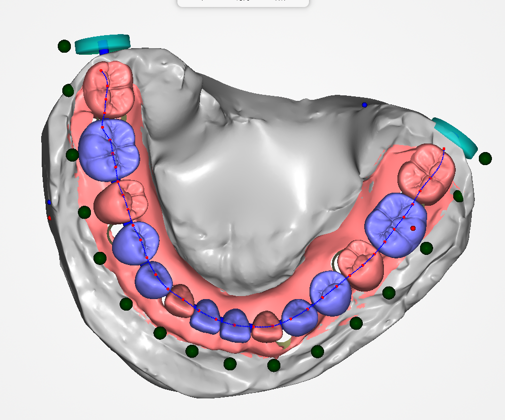

撤销恢复
保存恢复
调整面板参数改变基台形态（开启斜角、锁定聚合角度、平均插入方向生成基台、聚合角度、垂直补偿、圆角半径、网格大小）
拖拽器改变基台的斜角、高度功能

 

 

 

 

 

 

种植扫描分为口扫、模扫、口扫+面弓扫描，对于一体式（模型+扫描杆+牙龈完全一体;模型+扫描杆一体、牙龈单独分离）、分体式（模型、扫描杆、牙龈 完全分离, 模型（模型上面可能带牙龈)、扫描杆+牙龈）扫描件需要裁剪出扫描杆用于与标准杆配准。

 

 

 

 

根据牙龈若干种植体的方向和位置，切割牙龈网格拟合牙弓线，通过咬合和牙齿中线约束牙齿排列，碰撞检测排牙位置。送入牙齿牙龈模型得到咬合对齐的牙齿排列，支持上下单颌、双颌排牙

 

 

 

 

 

 

辅助马泷桥牙齿之间的连接体的范围约束，防止连接体穿插牙齿咬合面和牙齿底部及颊舌侧，对磨牙，尖牙，切牙的“咬合面”进行识别

 

 

 

***\*操作模式\****（***\*创建模式、编辑模式、草绘模式、删除模式\****（非必需）***\*、应用模式（\****非必需））： 

***\*通过菜单切换操作模式\**** 

***\*创建模式\****: 

Mesh 上左键点击或左键拖动: 绘制样条线 

左键单击小球：选中、拖动小球 

左键单击样条线：添加小球 

左键双击首尾小球：完成创建，进入编辑模式 

右键单击小球： 

点编辑菜单： 

移除点 

删除样条 

右键单击样条线： 

线编辑菜单： 

添加点 

删除样条

快捷键：鼠标悬浮小球+delete 删除小球 

***\*编辑模式\****： 

左键小球：选中、拖动小球 

左键单击样条线：添加点 

右键单击小球： 

点编辑菜单： 

移除点 

删除样条 

快速编辑模式（进入草绘模式） 

应用 

右键单击样条线： 

线编辑菜单： 

添加点 

删除样条 

快速编辑线条（进入草绘模式） 

应用 

快捷键：鼠标悬浮小球+delete 删除小球

***\*草绘模式\****： 

Mesh 上左键点击或者左键拖动：绘制样条，隐藏小球 

右键单击样条线： 

草绘菜单： 

删除样条线 

结束快速编辑模式（进入编辑模式） 

应用

 

牵引扣

 

自动贴面

 

 

 

 

 

 

 

磨除

 

 

 

剪切导板

 

 

非流行检测与修复

 

 

 

 

曲线裁剪曲面

 

 

 

补洞

